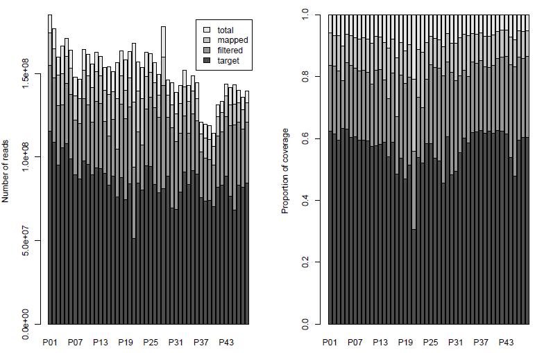
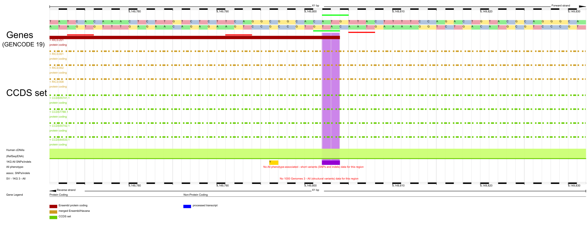
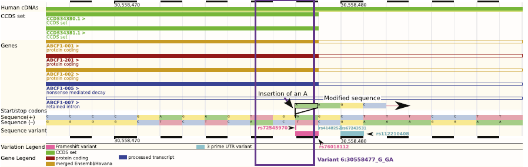
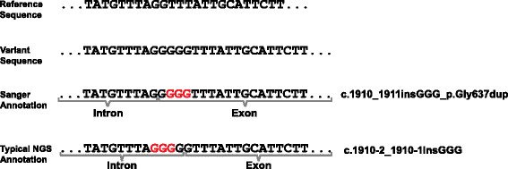
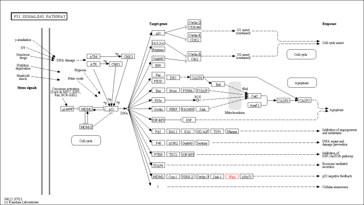
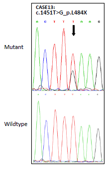
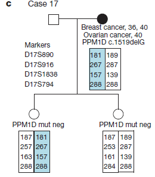
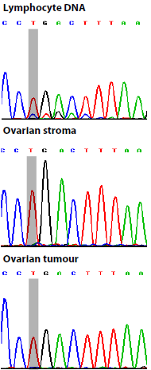
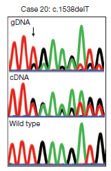

# Introduction

## Interpreting patient genomes

* Sequencing of patient genomes increasingly common
* Can identify relevant variants
* ... amongst a large number of unrelated variants
* ... can be difficult to interpret
* 
  Computational strategies critical to obtaining good set of candidates

Typical sequencing studies either focus on individual patients (or trios)
or larger cohorts.

Obviously these serve different objectives, either individual diagnosis/treatment
or generally gaining better understanding of phenotype.

Variants of interest may be rare or common. Will focus on rare variants in this talk.
Some of this also applies to cancer genomes but won't discuss that here.

## Finding rare disease related variants
Rare variants are of particular interest

* May have large effects
* ... but can be hard to find.

* Need large sample sizes
* ... but may still struggle to identify causal variants.

No guarantee that there are rare variants with moderate/large effects
in a given disease.

Even if they exist they likely to be only one of several factors involved
in disease risk and may be rare even in the disease population.

# Identifying Novel Breast Cancer Risk Variants
## Motivation
* Several DNA repair genes implicated in breast and ovarian cancer susceptibility.
* Strong evidence that rare loss-of-function variants confer increased risk.
* Sequencing large number of patients not carrying known risk variants should
  lead to discovery of new ones.

## Study design

* Exons of 507 DNA repair genes in 1,150 unrelated patients.
* Pools of 24 individuals.
* Included 79 individuals with known mutations in breast cancer predisposition
  genes as positive controls.

* No controls.
* No barcoding.
* Expect to do lots of Sanger sequencing in follow-up.

Note that no controls were sequenced and samples are pooled (no barcoding) to
reduce amount of time and money required.

69 individuals also had ovarian cancer.

## Analysis strategy

* Sequence pools with GAIIx HiSeq2000.
* Call variants in pools with [Syzygy](http://sourceforge.net/projects/syzygy/).
* Annotate variants to identify loss of function.
* Validate variants of interest.
* Sequence relevant genes in control panel.

* Aim for $\gt$ 10$\times$ coverage per genome in target regions.
* Should be able to detect singletons in pool.
* But of course coverage isn't uniform.

## Achieved coverage {.small}

$\gt$ 480$\times$ coverage in 90% of target region

* filtered reads to exclude
    * ambiguous alignments (MQ == 0)
    * masked bases with quality < 22
* poor performance for pool 22

## Variant calling

* Syzygy called 34,564 variants in target region.

* Performance for known variants:
    * 439/439 common SNPs
    * 24/26 rare SNPs
    * 51/54 rare (short) indels

* Sensitivity for rare SNPS: 92%
* Sensitivity for rare indels: 94%

# Aside: Annotating variants
## A simple plan

* Use EnsEMBL annotations (via Perl API)
* Identify protein truncating variants
* Group variants by gene to identify
  candidates for follow-up

. . .

But it isn't that easy...

* VEP was in its infancy at the time, using Perl API
  allowed for much more flexibility.
* In hindsight probably not the best choice. API not
  stable, hard to maintain code based on it. Also
  pretty slow.

## Beware of transcript annotations

<a href="http://www.genomemedicine.com/content/6/3/26" target="_blank">
McCarthy *et al.* Genome Medicine 2014 6:26
</a>

* EnsEMBL contains large number of transcripts.
* Not all transcripts well supported by evidence.
* Reporting the most severe consequence will enrich for false positives.
* Including transcripts that aren't expressed massively
  increases false positive annotations for PTV.

## Beware of edge effects

<a href="http://www.genomemedicine.com/content/6/3/26" target="_blank">
McCarthy *et al.* Genome Medicine 2014 6:26
</a>

* At the time of the study EnsEMBL incorrectly annotated this as *stop loss*.
* More recent versions of VEP correctly note that this is *frame shift/stop retained*.
* But note that the most severe consequence still is *frame shift*.

## Beware of misaligned indels

<a href="http://www.genomemedicine.com/content/7/1/76" target="_blank">Münz *et al.* Genome Medicine 2015 7:76</a>

* Indel position may be ambiguous.
* Variant callers typically report the *left most* position, i.e. position closest to 5' end of forward strand.
* Really should report position closest to 3' end of transcript.

# Back to the Breast Cancer Study {-}
## Selecting candidate genes

* Identified 1,044 PTVs
* Ranked genes by number of truncating mutations observed.
* Identify candidate genes

* Top ranking genes were BRCA2, CHEK1, ATM, BRCA1, ...
* Partially driven by positive controls.
* First interesting gene on list was PPM1D with 5 PTV.
* None of these PTVs present in 1000 Genomes.

## Investigating PPM1D {data-transition="none"}

* PPM1D is a phosphatase
* Phosphatase domain encoded by first 5 exons

## Investigating PPM1D {data-transition="none"}

All identified truncating mutations validated with Sanger sequencing.

## Phase 2: Case-control study {data-transition="none"}

* Sequenced PPM1D an additional 2456 cases and 1347 controls.
* Identified 10 additional PTVs (none in controls)

* All PTVs clustering in last exon
* proceeded to only sequence this region.

## Phase 2: Case-control study {data-transition="none"}

* Sequenced final exon only in 5325 cases and 4514 controls.
* Identified 15 additional PTVs in cases (1 in controls)

## Case-control summary

                Breast cancer     Ovarian cancer    controls
-----------   ----------------- ------------------ ----------
Sequenced         6,912              1,121            5,861
with PTV           18                  12              1
relative risk     2.7                  11.5
95% CI           1.3 - 5.3           4.3 - 30.4

## How does it work?

. . .

Cells expressing truncated versions of PPM1D show
reduced activation of p53 in response to ionizing
radiation.

Suggests truncated PTV is hyperactive.

# The Plot Thickens {-}
## A complication

* Read counts for variant alleles appear low.
* Difficult to assess in pools but also visible in trace data.
* Consistently low frequency of PTVs.

## Somatic variation?

* Could indicate that these are somatic mutations
* If these are germ line variants we should see them in children of carriers.

* No guarantee that there are informative families.
* Got lucky and found a few.

## Further complications

* PPM1D truncating mutations appear to be mosaic in lymphocytes.
* What does PPM1D look like in the tumour tissue?
    * Deep sequencing of DNA from tumour, stromal tissue and blood in four cases.
    * Found expected mutations in blood but not in tumour or stroma

# Discussion
## Possible interpretations

* Are these mutations present in cell of cancer origin but lost later?
* Is oncogenesis driven by lymphocytes?
* Are the PPM1D mutations only symptoms of an underlying problem that leads
  to cancer development in other tissues?
* Are PPM1D mutations and cancer unrelated?

## Loss during cancer development
* Evidence for loss of heterozygosity at PPMID locus.
* The lost haplotype is the one carrying the PTV in lymphocytes.
* Unclear whether the mutation was present prior to LOH event.
* Loss of heterozygosity in this region is common in breast and ovarian cancers.

* Lends some support to the hypothesis that mutations were initially present
* LOH may well be unrelated
* Evidence is inconclusive

## Oncogenesis driven by lymphocytes {.small}

* Only real evidence is absence of mutation in tumour.
* Unclear what the mechanism would be.

## Symptom of a bigger problem

* Could be a sign of general genome instability.
* This might lead to clonal expansion of cells with PPM1D PTVs as well as cancers.
* Unclear what the driver of this would be.

## Simply unrelated

* Evidence supporting some relationship between PPM1D PTVs and cancer seems strong.
* Observation has been replicated by [Akbari *et al.*, 2013](http://jnci.oxfordjournals.org/content/early/2013/11/18/jnci.djt323.full)
* Somatic PPM1D PTVs have been found in cancers ([Kleiblova *et al.*, 2013](http://jcb.rupress.org/content/201/4/511.full), [Zhang *et al.*, 2014](http://www.nature.com/ng/journal/v46/n7/full/ng.2995.html))

# Lessons Learned
## Finding rare variants

* Strategy to sequence as many cases as possible paid off.
* Would not have found PPM1D PTVs if we had split initial sequencing
  between cases and controls.
* A lot, but very focused, follow-up required.
* Focus on candidate gene panel paid off for similar reasons
* ... but means we have no easy way to check for other shared genomic
  variation amongst PPM1D PTV carriers.

## Somatic variation

* Were lucky that study design was suited to discovery of somatic variation.
* Can find somatic variants through deep sequencing
* but proving that a variant is somatic can be difficult in absence of control tissue.
* Variant frequency in gDNA and RNA may differ markedly.

## Variant annotation {data-transition="none"}

* Be careful with automated annotations.
* Have improved a lot over the last few years
* ... but can still be misleading or incomplete.
* Consider PPM1D PTVs

## Variant annotation {data-transition="none"}

* Be careful with automated annotations.
* Have improved a lot over the last few years
* ... but can still be misleading or incomplete.
* Consider PPM1D PTVs
     * Truncation of final exon.
     * (Correctly) predicted to escape nonsense mediated decay.
     * So not loss of function.
     * Doesn't mean we should ignore it!

# Acknowledgements {data-transition="none"}
## Acknowledgements {data-transition="none"}

### WTCHG
**Peter Donnelly**

Manuel Rivas

Andrew Rimmer

Davis McCarthy

### ICR
**Nazneen Rahman**

Elise Ruark

Katie Snape

